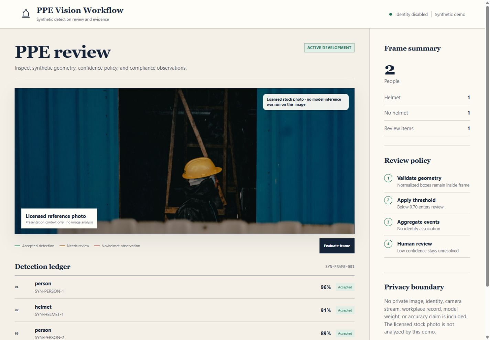
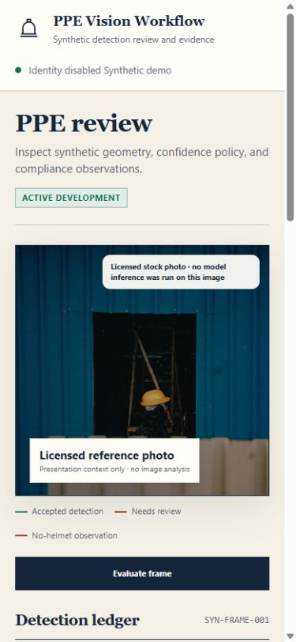
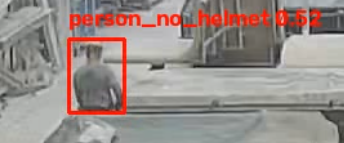
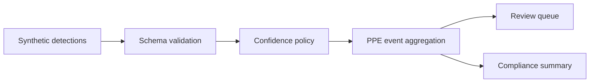

# PPE Vision Workflow Demo

> **Status:** This project is currently under active development. Evaluation rules, event schemas,
> and interface details may change as the prototype evolves.

A public-safe demonstration of the workflow around an industrial PPE detection model. It validates
synthetic detection events, aggregates helmet/no-helmet observations, identifies low-confidence
items for review, and exposes the evidence through FastAPI and a responsive index dashboard.

This repository contains no private dataset, raw video, employee identity, camera or site identifier,
model weight, or production metric. All API detections are synthetic. One owner-authorized,
de-identified prototype reference frame is included only to document the early visual direction; it
is not a benchmark, training example, or production safety record.

## Interface

<p align="center">
  
  
</p>

## Media boundary

The page uses one credited Pexels photo only as presentation context. The API never receives it; no
inference, identity, or safety conclusion is made from the image. See `ASSET_CREDITS.md`.

## Limited prototype reference

<p align="center">
  
</p>

This is the sole owner-authorized industrial reference frame in the repository. It is deliberately
low resolution, contains no visible face, person name, camera identifier, site name, or production
metadata, and is not used by the demo API. No additional factory imagery belongs in the public
repository without a fresh privacy and authorization review.

## Architecture



## Demonstrated concepts

- typed bounding-box events;
- confidence thresholds and review states;
- person/helmet/no-helmet aggregation without identity tracking;
- class and coordinate validation;
- synthetic visual overlay and automated tests.

No accuracy percentage is claimed because no public benchmark dataset is shipped with this demo.

## Run

```bash
python -m pip install -e ".[dev]"
uvicorn app.main:app --reload
pytest
ruff check .
```

Open `http://127.0.0.1:8000` or inspect `/docs`.
